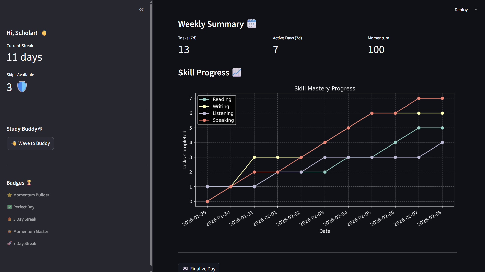

# Study Momentum - IELTS Prototype

## 🚨 Environment Setup Required

**Note:** It appears that Python is not correctly installed or configured on this system (missing base interpreter for existing venvs, and broken execution aliases). You will need to install Python to run this prototype.

### 1. Install Python
Download and install Python (3.9+) from [python.org](https://www.python.org/downloads/).
*Make sure to check "Add Python to PATH" during installation.*

### 2. Create Virtual Environment
Open a terminal in this directory (`d:\My Projects\LEAP Assingment`) and run:

```bash
python -m venv .venv
```

### 3. Activate Virtual Environment
**Windows (PowerShell):**
```powershell
.\.venv\Scripts\Activate
```

**Mac/Linux:**
```bash
source .venv/bin/activate
```

### 4. Install Dependencies
```bash
pip install -r requirements.txt
```

### 5. Run the Application
```bash
streamlit run app.py
```

## Features
- **Onboarding**: Set your target score and exam date.
- **Daily Tasks**: 3 generated tasks based on your weakest skill.
- **Momentum Score**: Earn points for completing tasks, lose points for skipping days.
- **Skill Tracker**: Visualize your progress over time.
- **Study Buddy**: Simulated peer activity updates.

## Screenshots




